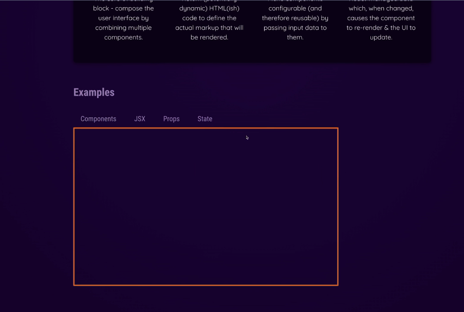

Change the different content below the buttons like Component, JSX, Props and State once they clicked.

Component, JSX, Props and State --> these are custom components and not have built in button components.

So, in order to set and update hard coded "dynamic content" as per the click on specific custom component, need to listen to the specific custom component's button. Because you must handle the event in the component that also manages the data that should be changed(i.e. the "dynamic content" that should be displayed in this case).

Custom button components <TabButton> in the end just wrap native JSX element to be precise. So, built-in components provided by React. Built-in buttons have built-in onClick prop

<li>
      <button onClick={onSelect}>{children}</button>
</li>

Therefor own custom component <TabButton> clickable, we will set the value i.e here the onClick prop value of built-in button from outside of custom component. So, in this case App Component

onClick={} --> function as a value
