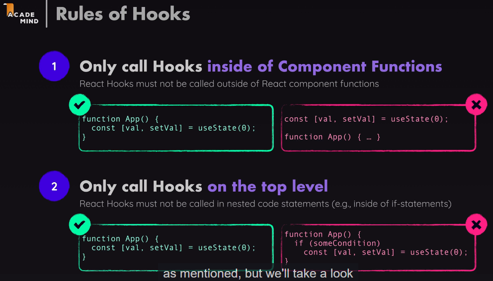

App component function is not executed again just because By default react component executes only once.
So, entire JSX code inside app component is not getting re-evaluated. So, it knows only initial ta content value.

state:

- registering variables those are handled by React and that are updated with help of a function that's provided by React and also tell React that data changed and that will cause React to update the UI.
- these are special variable are created with help of a special function and that must be imported from the React library.
- import the useState function from react library.
- useState is a regular functions and must only be called inside of React component functions or inside of other React Hooks. For ex: custom react hooks.
- must call useState() or hook functions inside of the component function and not nested inside of other code that means not nested inside of inner function.
