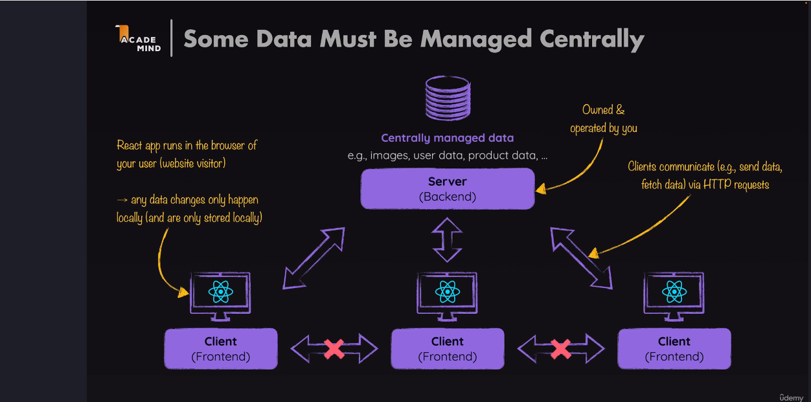
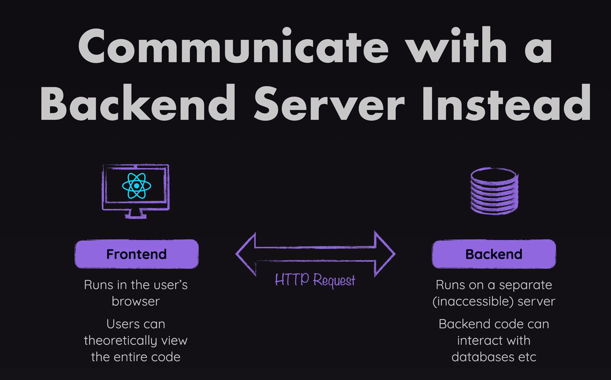
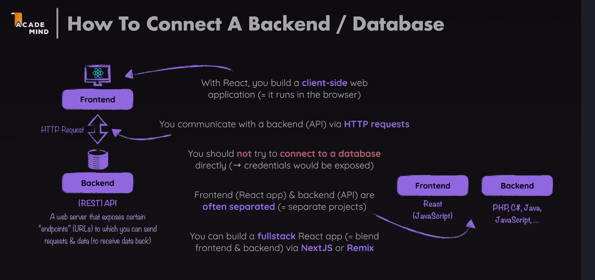

- Central server which is connected by multiple react instances connect in order to share data across users.

* different parts of globe can connect to central data and send data

HOW TO CONNECT YOUR REACT APP TO DATABASE

## React code runs in the browsers that developers wrote

## So the visitors can able to access or view the react code

## the credentials should protect from the outsiders

# Not all operations can be performed in the browser. Ex: can't access(centrally managed) a file system.

backend code can able to accessible with http request

